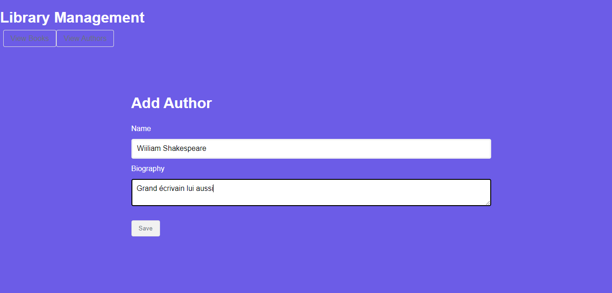
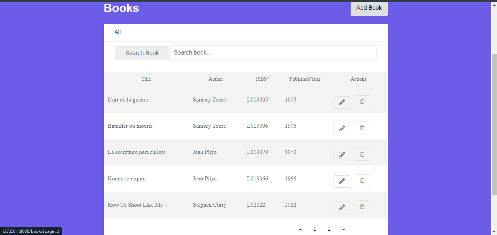

# Projet de Gestion d'une Bibliothèque

## Description

Ce projet est une application de gestion de bibliothèque développée avec Laravel. Il permet de gérer des auteurs et leurs livres associés. Les fonctionnalités incluent l'ajout, la modification, la suppression et la visualisation des auteurs et des livres.

## Captures d'Écran

### Liste des Auteurs


### Ajouter un Auteur



### Liste des Auteurs avec pagination


### Modifier un Auteur


### Supprimer un Auteur


### Liste des Livres avec pagination



### Ajouter un Livre


### Modifier un Livre


### Supprimer un Livre


## Installation des dépendances

composer install
npm install
npm run dev


### 1. Cloner le dépôt

```bash
git clone https://github.com/ton_nom_utilisateur/bibliotheque.git
cd bibliotheque

# bibliotheque_laravel
# Projet de Gestion d'une Bibliothèque

## Description

Ce projet est une application de gestion de bibliothèque développée avec Laravel. Il permet de gérer des auteurs et leurs livres associés. Les fonctionnalités incluent l'ajout, la modification, la suppression et la visualisation des auteurs et des livres.

## Captures d'Écran

### Liste des Auteurs


### Ajouter un Auteur


### Liste des Auteurs avec pagination


### Modifier un Auteur


### Supprimer un Auteur


### Liste des Livres avec pagination


### Ajouter un Livre


### Modifier un Livre


### Supprimer un Livre


## Installation des dépendances

composer install
npm install
npm run dev


